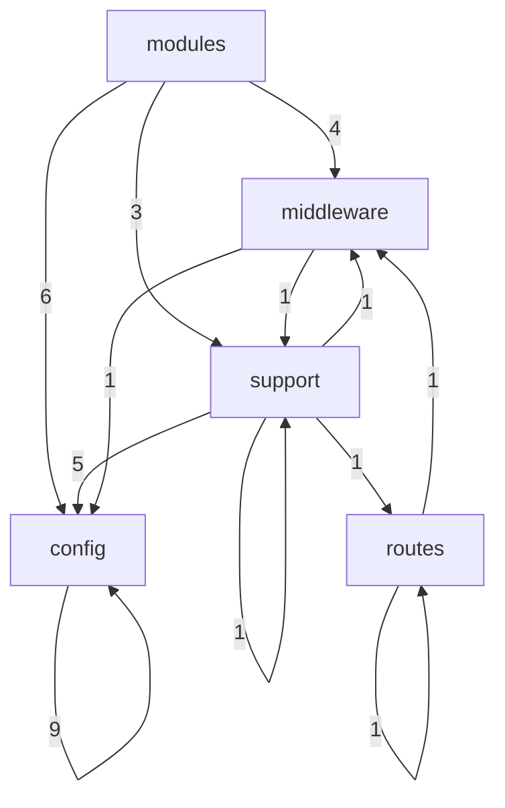
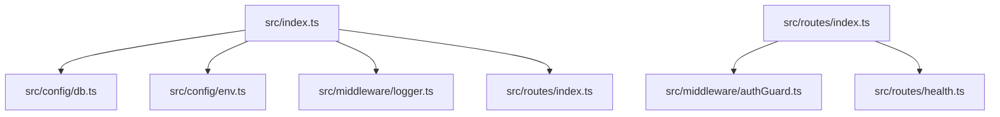
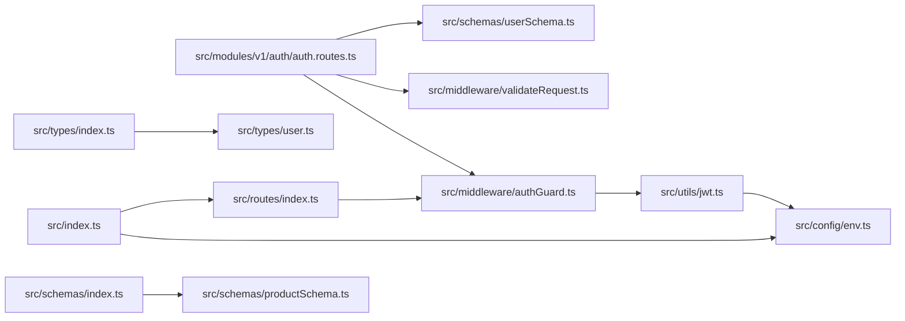

# Flow

## Flow Document Purpose

- Repository: `candleaf-server-express`
- Category: `backend`
- This document explains how the codebase is wired together using actual local file imports when they are available.
- Folder names and path categories are used only as a fallback when an exact runtime link is not directly visible from source imports.
- Mermaid diagrams below are repository-local diagrams intended for scanning architecture flow, not pixel-perfect runtime sequence diagrams.
- External services are called out only when the repository declares them in code or package metadata.

## Reading Guide

- `Entry points` are files that appear to bootstrap the app, server, router, or top-level runtime.
- `Outgoing links` are local repository imports from one file to another.
- `Incoming links` are local repository files that import the current file.
- `External packages` are package imports seen in source files and are listed separately from local file links.
- `Flow position` is derived from the file category plus observed import relationships.

## Repository Surface Snapshot

- Total scanned files: `69`
- Files with local outgoing imports: `17`
- Files with local incoming imports: `20`
- Root directories: `4`
- Root files: `11`
- Category count: `5`

## Top-Level Directories

- `.vscode/`
- `dist/`
- `docs/`
- `src/`

## Top-Level Files

- `.gitignore`
- `.prettierrc`
- `DOCS.md`
- `README.md`
- `eslint.config.ts`
- `package.json`
- `pnpm-lock.yaml`
- `pnpm-workspace.yaml`
- `render.yaml`
- `tsc-log.txt`
- `tsconfig.json`

## Category Inventory

- `config`: `13` files
- `middleware`: `3` files
- `modules`: `36` files
- `routes`: `2` files
- `support`: `15` files

## Entry Points

- `src/index.ts`
- `src/routes/index.ts`

## Category-Level Diagram

## Entry Flow Diagram

## Hotspot File Diagram

## Category Flow Notes

- `config` exports `9` observed category-to-category local links and receives `21` incoming category links
- `middleware` exports `2` observed category-to-category local links and receives `6` incoming category links
- `modules` exports `13` observed category-to-category local links and receives `0` incoming category links
- `routes` exports `2` observed category-to-category local links and receives `2` incoming category links
- `support` exports `8` observed category-to-category local links and receives `5` incoming category links

## File-Level Flow Inventory

### `config` Layer

- File: `src/config/db.ts`
- Flow position: `config`
- Local outgoing link count: `1`
- Outgoing -> `src/config/env.ts`
- Local incoming link count: `1`
- Incoming <- `src/index.ts`
- External package link count: `4`
- External -> `connect-mongo`
- External -> `express`
- External -> `express-session`
- External -> `mongoose`
-
- File: `src/config/env.ts`
- Flow position: `config`
- Local outgoing link count: `1`
- Outgoing -> `src/schemas/envSchema.ts`
- Local incoming link count: `6`
- Incoming <- `src/config/db.ts`
- Incoming <- `src/index.ts`
- Incoming <- `src/middleware/logger.ts`
- Incoming <- `src/modules/v1/auth/auth.controller.ts`
- Incoming <- `src/providers/sendgrid.provider.ts`
- Incoming <- `src/utils/jwt.ts`
- External package link count: `1`
- External -> `dotenv`
-
- File: `src/schemas/authSchema.ts`
- Flow position: `config`
- Local outgoing link count: `0`
- Outgoing -> `None confirmed from local imports`
- Local incoming link count: `2`
- Incoming <- `src/modules/v1/auth/auth.routes.ts`
- Incoming <- `src/schemas/index.ts`
- External package link count: `1`
- External -> `zod`
-
- File: `src/schemas/cartSchema.ts`
- Flow position: `config`
- Local outgoing link count: `0`
- Outgoing -> `None confirmed from local imports`
- Local incoming link count: `1`
- Incoming <- `src/schemas/index.ts`
- External package link count: `1`
- External -> `zod`
-
- File: `src/schemas/envSchema.ts`
- Flow position: `config`
- Local outgoing link count: `0`
- Outgoing -> `None confirmed from local imports`
- Local incoming link count: `2`
- Incoming <- `src/config/env.ts`
- Incoming <- `src/schemas/index.ts`
- External package link count: `1`
- External -> `zod`
-
- File: `src/schemas/index.ts`
- Flow position: `config`
- Local outgoing link count: `6`
- Outgoing -> `src/schemas/authSchema.ts`
- Outgoing -> `src/schemas/cartSchema.ts`
- Outgoing -> `src/schemas/envSchema.ts`
- Outgoing -> `src/schemas/orderSchema.ts`
- Outgoing -> `src/schemas/productSchema.ts`
- Outgoing -> `src/schemas/wishlistSchema.ts`
- Local incoming link count: `0`
- Incoming <- `None confirmed from local imports`
- External -> `None confirmed from import statements`
-
- File: `src/schemas/orderSchema.ts`
- Flow position: `config`
- Local outgoing link count: `0`
- Outgoing -> `None confirmed from local imports`
- Local incoming link count: `1`
- Incoming <- `src/schemas/index.ts`
- External package link count: `1`
- External -> `zod`
-
- File: `src/schemas/productSchema.ts`
- Flow position: `config`
- Local outgoing link count: `0`
- Outgoing -> `None confirmed from local imports`
- Local incoming link count: `2`
- Incoming <- `src/modules/v1/products/product.routes.ts`
- Incoming <- `src/schemas/index.ts`
- External package link count: `1`
- External -> `zod`
-
- File: `src/schemas/userSchema.ts`
- Flow position: `config`
- Local outgoing link count: `0`
- Outgoing -> `None confirmed from local imports`
- Local incoming link count: `2`
- Incoming <- `src/modules/v1/auth/auth.routes.ts`
- Incoming <- `src/modules/v1/user/user.routes.ts`
- External package link count: `1`
- External -> `zod`
-
- File: `src/schemas/wishlistSchema.ts`
- Flow position: `config`
- Local outgoing link count: `0`
- Outgoing -> `None confirmed from local imports`
- Local incoming link count: `1`
- Incoming <- `src/schemas/index.ts`
- External package link count: `1`
- External -> `zod`
-
- File: `src/types/express.d.ts`
- Flow position: `config`
- Local outgoing link count: `0`
- Outgoing -> `None confirmed from local imports`
- Local incoming link count: `0`
- Incoming <- `None confirmed from local imports`
- External package link count: `3`
- External -> `express`
- External -> `http`
- External -> `mongoose`
-
- File: `src/types/index.ts`
- Flow position: `config`
- Local outgoing link count: `1`
- Outgoing -> `src/types/user.ts`
- Local incoming link count: `1`
- Incoming <- `src/modules/v1/auth/auth.service.ts`
- External -> `None confirmed from import statements`
-
- File: `src/types/user.ts`
- Flow position: `config`
- Local outgoing link count: `0`
- Outgoing -> `None confirmed from local imports`
- Local incoming link count: `2`
- Incoming <- `src/providers/google.provider.ts`
- Incoming <- `src/types/index.ts`
- External package link count: `2`
- External -> `express`
- External -> `mongoose`
-

### `middleware` Layer

- File: `src/middleware/authGuard.ts`
- Flow position: `middleware`
- Local outgoing link count: `1`
- Outgoing -> `src/utils/jwt.ts`
- Local incoming link count: `2`
- Incoming <- `src/modules/v1/auth/auth.routes.ts`
- Incoming <- `src/routes/index.ts`
- External package link count: `1`
- External -> `express`
-
- File: `src/middleware/logger.ts`
- Flow position: `middleware`
- Local outgoing link count: `1`
- Outgoing -> `src/config/env.ts`
- Local incoming link count: `1`
- Incoming <- `src/index.ts`
- External package link count: `5`
- External -> `fs`
- External -> `http`
- External -> `path`
- External -> `pino`
- External -> `pino-http`
-
- File: `src/middleware/validateRequest.ts`
- Flow position: `middleware`
- Local outgoing link count: `0`
- Outgoing -> `None confirmed from local imports`
- Local incoming link count: `3`
- Incoming <- `src/modules/v1/auth/auth.routes.ts`
- Incoming <- `src/modules/v1/products/product.routes.ts`
- Incoming <- `src/modules/v1/user/user.routes.ts`
- External package link count: `2`
- External -> `express`
- External -> `zod`
-

### `modules` Layer

- File: `src/modules/v1/admin/admin.controller.ts`
- Flow position: `modules`
- Local outgoing link count: `0`
- Outgoing -> `None confirmed from local imports`
- Local incoming link count: `0`
- Incoming <- `None confirmed from local imports`
- External package link count: `1`
- External -> `express`
-
- File: `src/modules/v1/admin/admin.routes.ts`
- Flow position: `modules`
- Local outgoing link count: `0`
- Outgoing -> `None confirmed from local imports`
- Local incoming link count: `0`
- Incoming <- `None confirmed from local imports`
- External package link count: `1`
- External -> `express`
-
- File: `src/modules/v1/auth/auth.controller.ts`
- Flow position: `modules`
- Local outgoing link count: `1`
- Outgoing -> `src/config/env.ts`
- Local incoming link count: `0`
- Incoming <- `None confirmed from local imports`
- External package link count: `1`
- External -> `express`
-
- File: `src/modules/v1/auth/auth.model.ts`
- Flow position: `modules`
- Local outgoing link count: `0`
- Outgoing -> `None confirmed from local imports`
- Local incoming link count: `0`
- Incoming <- `None confirmed from local imports`
- External package link count: `1`
- External -> `mongoose`
-
- File: `src/modules/v1/auth/auth.repo.ts`
- Flow position: `modules`
- Local outgoing link count: `0`
- Outgoing -> `None confirmed from local imports`
- Local incoming link count: `0`
- Incoming <- `None confirmed from local imports`
- External package link count: `1`
- External -> `mongoose`
-
- File: `src/modules/v1/auth/auth.routes.ts`
- Flow position: `modules`
- Local outgoing link count: `4`
- Outgoing -> `src/middleware/authGuard.ts`
- Outgoing -> `src/middleware/validateRequest.ts`
- Outgoing -> `src/schemas/authSchema.ts`
- Outgoing -> `src/schemas/userSchema.ts`
- Local incoming link count: `0`
- Incoming <- `None confirmed from local imports`
- External package link count: `1`
- External -> `express`
-
- File: `src/modules/v1/auth/auth.service.ts`
- Flow position: `modules`
- Local outgoing link count: `2`
- Outgoing -> `src/types/index.ts`
- Outgoing -> `src/utils/jwt.ts`
- Local incoming link count: `0`
- Incoming <- `None confirmed from local imports`
- External package link count: `1`
- External -> `bcryptjs`
-
- File: `src/modules/v1/cart/cart.controller.ts`
- Flow position: `modules`
- Local outgoing link count: `0`
- Outgoing -> `None confirmed from local imports`
- Local incoming link count: `0`
- Incoming <- `None confirmed from local imports`
- External package link count: `1`
- External -> `express`
-
- File: `src/modules/v1/cart/cart.model.ts`
- Flow position: `modules`
- Local outgoing link count: `0`
- Outgoing -> `None confirmed from local imports`
- Local incoming link count: `0`
- Incoming <- `None confirmed from local imports`
- External package link count: `1`
- External -> `mongoose`
-
- File: `src/modules/v1/cart/cart.service.ts`
- Flow position: `modules`
- Local outgoing link count: `0`
- Outgoing -> `None confirmed from local imports`
- Local incoming link count: `0`
- Incoming <- `None confirmed from local imports`
- External -> `None confirmed from import statements`
-
- File: `src/modules/v1/checkout/checkout.controller.ts`
- Flow position: `modules`
- Local outgoing link count: `2`
- Outgoing -> `src/utils/generate.ts`
- Outgoing -> `src/utils/getNextOrderNumber.ts`
- Local incoming link count: `0`
- Incoming <- `None confirmed from local imports`
- External package link count: `1`
- External -> `express`
-
- File: `src/modules/v1/checkout/checkout.routes.ts`
- Flow position: `modules`
- Local outgoing link count: `0`
- Outgoing -> `None confirmed from local imports`
- Local incoming link count: `0`
- Incoming <- `None confirmed from local imports`
- External package link count: `1`
- External -> `express`
-
- File: `src/modules/v1/order/counter.model.ts`
- Flow position: `modules`
- Local outgoing link count: `0`
- Outgoing -> `None confirmed from local imports`
- Local incoming link count: `0`
- Incoming <- `None confirmed from local imports`
- External package link count: `1`
- External -> `mongoose`
-
- File: `src/modules/v1/order/order.controller.ts`
- Flow position: `modules`
- Local outgoing link count: `0`
- Outgoing -> `None confirmed from local imports`
- Local incoming link count: `0`
- Incoming <- `None confirmed from local imports`
- External package link count: `1`
- External -> `express`
-
- File: `src/modules/v1/order/order.model.ts`
- Flow position: `modules`
- Local outgoing link count: `0`
- Outgoing -> `None confirmed from local imports`
- Local incoming link count: `0`
- Incoming <- `None confirmed from local imports`
- External package link count: `1`
- External -> `mongoose`
-
- File: `src/modules/v1/order/order.repo.ts`
- Flow position: `modules`
- Local outgoing link count: `0`
- Outgoing -> `None confirmed from local imports`
- Local incoming link count: `0`
- Incoming <- `None confirmed from local imports`
- External -> `None confirmed from import statements`
-
- File: `src/modules/v1/order/order.routes.ts`
- Flow position: `modules`
- Local outgoing link count: `0`
- Outgoing -> `None confirmed from local imports`
- Local incoming link count: `0`
- Incoming <- `None confirmed from local imports`
- External package link count: `2`
- External -> `express`
- External -> `mongoose`
-
- File: `src/modules/v1/order/order.service.ts`
- Flow position: `modules`
- Local outgoing link count: `0`
- Outgoing -> `None confirmed from local imports`
- Local incoming link count: `0`
- Incoming <- `None confirmed from local imports`
- External -> `None confirmed from import statements`
-
- File: `src/modules/v1/products/product.controller.ts`
- Flow position: `modules`
- Local outgoing link count: `0`
- Outgoing -> `None confirmed from local imports`
- Local incoming link count: `0`
- Incoming <- `None confirmed from local imports`
- External package link count: `1`
- External -> `express`
-
- File: `src/modules/v1/products/product.model.ts`
- Flow position: `modules`
- Local outgoing link count: `0`
- Outgoing -> `None confirmed from local imports`
- Local incoming link count: `0`
- Incoming <- `None confirmed from local imports`
- External package link count: `1`
- External -> `mongoose`
-
- File: `src/modules/v1/products/product.repo.ts`
- Flow position: `modules`
- Local outgoing link count: `0`
- Outgoing -> `None confirmed from local imports`
- Local incoming link count: `0`
- Incoming <- `None confirmed from local imports`
- External -> `None confirmed from import statements`
-
- File: `src/modules/v1/products/product.routes.ts`
- Flow position: `modules`
- Local outgoing link count: `2`
- Outgoing -> `src/middleware/validateRequest.ts`
- Outgoing -> `src/schemas/productSchema.ts`
- Local incoming link count: `0`
- Incoming <- `None confirmed from local imports`
- External package link count: `1`
- External -> `express`
-
- File: `src/modules/v1/products/product.service.ts`
- Flow position: `modules`
- Local outgoing link count: `0`
- Outgoing -> `None confirmed from local imports`
- Local incoming link count: `0`
- Incoming <- `None confirmed from local imports`
- External -> `None confirmed from import statements`
-
- File: `src/modules/v1/public/contact.controller.ts`
- Flow position: `modules`
- Local outgoing link count: `0`
- Outgoing -> `None confirmed from local imports`
- Local incoming link count: `0`
- Incoming <- `None confirmed from local imports`
- External package link count: `1`
- External -> `express`
-
- File: `src/modules/v1/public/contact.model.ts`
- Flow position: `modules`
- Local outgoing link count: `0`
- Outgoing -> `None confirmed from local imports`
- Local incoming link count: `0`
- Incoming <- `None confirmed from local imports`
- External package link count: `1`
- External -> `mongoose`
-
- File: `src/modules/v1/public/public.routes.ts`
- Flow position: `modules`
- Local outgoing link count: `0`
- Outgoing -> `None confirmed from local imports`
- Local incoming link count: `0`
- Incoming <- `None confirmed from local imports`
- External package link count: `1`
- External -> `express`
-
- File: `src/modules/v1/user/user.controller.ts`
- Flow position: `modules`
- Local outgoing link count: `0`
- Outgoing -> `None confirmed from local imports`
- Local incoming link count: `0`
- Incoming <- `None confirmed from local imports`
- External package link count: `1`
- External -> `express`
-
- File: `src/modules/v1/user/user.model.ts`
- Flow position: `modules`
- Local outgoing link count: `0`
- Outgoing -> `None confirmed from local imports`
- Local incoming link count: `0`
- Incoming <- `None confirmed from local imports`
- External package link count: `1`
- External -> `mongoose`
-
- File: `src/modules/v1/user/user.repo.ts`
- Flow position: `modules`
- Local outgoing link count: `0`
- Outgoing -> `None confirmed from local imports`
- Local incoming link count: `0`
- Incoming <- `None confirmed from local imports`
- External -> `None confirmed from import statements`
-
- File: `src/modules/v1/user/user.routes.ts`
- Flow position: `modules`
- Local outgoing link count: `2`
- Outgoing -> `src/middleware/validateRequest.ts`
- Outgoing -> `src/schemas/userSchema.ts`
- Local incoming link count: `0`
- Incoming <- `None confirmed from local imports`
- External package link count: `1`
- External -> `express`
-
- File: `src/modules/v1/user/user.service.ts`
- Flow position: `modules`
- Local outgoing link count: `0`
- Outgoing -> `None confirmed from local imports`
- Local incoming link count: `0`
- Incoming <- `None confirmed from local imports`
- External -> `None confirmed from import statements`
-
- File: `src/modules/v1/wishlist/wishlist.controller.ts`
- Flow position: `modules`
- Local outgoing link count: `0`
- Outgoing -> `None confirmed from local imports`
- Local incoming link count: `0`
- Incoming <- `None confirmed from local imports`
- External package link count: `1`
- External -> `express`
-
- File: `src/modules/v1/wishlist/wishlist.model.ts`
- Flow position: `modules`
- Local outgoing link count: `0`
- Outgoing -> `None confirmed from local imports`
- Local incoming link count: `0`
- Incoming <- `None confirmed from local imports`
- External package link count: `1`
- External -> `mongoose`
-
- File: `src/modules/v1/wishlist/wishlist.repo.ts`
- Flow position: `modules`
- Local outgoing link count: `0`
- Outgoing -> `None confirmed from local imports`
- Local incoming link count: `0`
- Incoming <- `None confirmed from local imports`
- External -> `None confirmed from import statements`
-
- File: `src/modules/v1/wishlist/wishlist.routes.ts`
- Flow position: `modules`
- Local outgoing link count: `0`
- Outgoing -> `None confirmed from local imports`
- Local incoming link count: `0`
- Incoming <- `None confirmed from local imports`
- External package link count: `1`
- External -> `express`
-
- File: `src/modules/v1/wishlist/wishlist.service.ts`
- Flow position: `modules`
- Local outgoing link count: `0`
- Outgoing -> `None confirmed from local imports`
- Local incoming link count: `0`
- Incoming <- `None confirmed from local imports`
- External -> `None confirmed from import statements`
-

### `routes` Layer

- File: `src/routes/health.ts`
- Flow position: `routes`
- Local outgoing link count: `0`
- Outgoing -> `None confirmed from local imports`
- Local incoming link count: `1`
- Incoming <- `src/routes/index.ts`
- External package link count: `1`
- External -> `express`
-
- File: `src/routes/index.ts`
- Flow position: `routes`
- Local outgoing link count: `2`
- Outgoing -> `src/middleware/authGuard.ts`
- Outgoing -> `src/routes/health.ts`
- Local incoming link count: `1`
- Incoming <- `src/index.ts`
- External package link count: `1`
- External -> `express`
-

### `support` Layer

- File: `eslint.config.ts`
- Flow position: `support`
- Local outgoing link count: `0`
- Outgoing -> `None confirmed from local imports`
- Local incoming link count: `0`
- Incoming <- `None confirmed from local imports`
- External package link count: `1`
- External -> `eslint-define-config`
-
- File: `package.json`
- Flow position: `support`
- Local outgoing link count: `0`
- Outgoing -> `None confirmed from local imports`
- Local incoming link count: `0`
- Incoming <- `None confirmed from local imports`
- External -> `None confirmed from import statements`
-
- File: `pnpm-lock.yaml`
- Flow position: `support`
- Local outgoing link count: `0`
- Outgoing -> `None confirmed from local imports`
- Local incoming link count: `0`
- Incoming <- `None confirmed from local imports`
- External -> `None confirmed from import statements`
-
- File: `pnpm-workspace.yaml`
- Flow position: `support`
- Local outgoing link count: `0`
- Outgoing -> `None confirmed from local imports`
- Local incoming link count: `0`
- Incoming <- `None confirmed from local imports`
- External -> `None confirmed from import statements`
-
- File: `render.yaml`
- Flow position: `support`
- Local outgoing link count: `0`
- Outgoing -> `None confirmed from local imports`
- Local incoming link count: `0`
- Incoming <- `None confirmed from local imports`
- External -> `None confirmed from import statements`
-
- File: `src/index.ts`
- Flow position: `support`
- Local outgoing link count: `4`
- Outgoing -> `src/config/db.ts`
- Outgoing -> `src/config/env.ts`
- Outgoing -> `src/middleware/logger.ts`
- Outgoing -> `src/routes/index.ts`
- Local incoming link count: `0`
- Incoming <- `None confirmed from local imports`
- External package link count: `3`
- External -> `cookie-parser`
- External -> `cors`
- External -> `express`
-
- File: `src/providers/google.provider.ts`
- Flow position: `support`
- Local outgoing link count: `2`
- Outgoing -> `src/types/user.ts`
- Outgoing -> `src/utils/index.ts`
- Local incoming link count: `0`
- Incoming <- `None confirmed from local imports`
- External -> `None confirmed from import statements`
-
- File: `src/providers/sendgrid.provider.ts`
- Flow position: `support`
- Local outgoing link count: `1`
- Outgoing -> `src/config/env.ts`
- Local incoming link count: `0`
- Incoming <- `None confirmed from local imports`
- External package link count: `1`
- External -> `@sendgrid/mail`
-
- File: `src/scripts/clear-db.ts`
- Flow position: `support`
- Local outgoing link count: `0`
- Outgoing -> `None confirmed from local imports`
- Local incoming link count: `0`
- Incoming <- `None confirmed from local imports`
- External package link count: `2`
- External -> `dotenv`
- External -> `mongoose`
-
- File: `src/utils/generate.ts`
- Flow position: `support`
- Local outgoing link count: `0`
- Outgoing -> `None confirmed from local imports`
- Local incoming link count: `1`
- Incoming <- `src/modules/v1/checkout/checkout.controller.ts`
- External package link count: `1`
- External -> `crypto`
-
- File: `src/utils/getNextOrderNumber.ts`
- Flow position: `support`
- Local outgoing link count: `0`
- Outgoing -> `None confirmed from local imports`
- Local incoming link count: `1`
- Incoming <- `src/modules/v1/checkout/checkout.controller.ts`
- External -> `None confirmed from import statements`
-
- File: `src/utils/index.ts`
- Flow position: `support`
- Local outgoing link count: `0`
- Outgoing -> `None confirmed from local imports`
- Local incoming link count: `1`
- Incoming <- `src/providers/google.provider.ts`
- External -> `None confirmed from import statements`
-
- File: `src/utils/jwt.ts`
- Flow position: `support`
- Local outgoing link count: `1`
- Outgoing -> `src/config/env.ts`
- Local incoming link count: `2`
- Incoming <- `src/middleware/authGuard.ts`
- Incoming <- `src/modules/v1/auth/auth.service.ts`
- External package link count: `1`
- External -> `jsonwebtoken`
-
- File: `src/utils/password.ts`
- Flow position: `support`
- Local outgoing link count: `0`
- Outgoing -> `None confirmed from local imports`
- Local incoming link count: `0`
- Incoming <- `None confirmed from local imports`
- External package link count: `1`
- External -> `bcryptjs`
-
- File: `tsconfig.json`
- Flow position: `support`
- Local outgoing link count: `0`
- Outgoing -> `None confirmed from local imports`
- Local incoming link count: `0`
- Incoming <- `None confirmed from local imports`
- External -> `None confirmed from import statements`
-

## Cross-Layer Edge Summary

- `config` -> `config`: `9` observed local import links
- `modules` -> `config`: `6` observed local import links
- `support` -> `config`: `5` observed local import links
- `modules` -> `middleware`: `4` observed local import links
- `modules` -> `support`: `3` observed local import links
- `middleware` -> `config`: `1` observed local import links
- `middleware` -> `support`: `1` observed local import links
- `routes` -> `middleware`: `1` observed local import links
- `routes` -> `routes`: `1` observed local import links
- `support` -> `middleware`: `1` observed local import links
- `support` -> `routes`: `1` observed local import links
- `support` -> `support`: `1` observed local import links

## Observed Hotspots

- `src/config/env.ts`: `7` combined local import links
- `src/schemas/index.ts`: `6` combined local import links
- `src/modules/v1/auth/auth.routes.ts`: `4` combined local import links
- `src/index.ts`: `4` combined local import links
- `src/utils/jwt.ts`: `3` combined local import links
- `src/routes/index.ts`: `3` combined local import links
- `src/middleware/validateRequest.ts`: `3` combined local import links
- `src/middleware/authGuard.ts`: `3` combined local import links
- `src/types/user.ts`: `2` combined local import links
- `src/types/index.ts`: `2` combined local import links
- `src/schemas/userSchema.ts`: `2` combined local import links
- `src/schemas/productSchema.ts`: `2` combined local import links
- `src/schemas/envSchema.ts`: `2` combined local import links
- `src/schemas/authSchema.ts`: `2` combined local import links
- `src/providers/google.provider.ts`: `2` combined local import links
- `src/modules/v1/user/user.routes.ts`: `2` combined local import links
- `src/modules/v1/products/product.routes.ts`: `2` combined local import links
- `src/modules/v1/checkout/checkout.controller.ts`: `2` combined local import links
- `src/modules/v1/auth/auth.service.ts`: `2` combined local import links
- `src/middleware/logger.ts`: `2` combined local import links
- `src/config/db.ts`: `2` combined local import links
- `src/utils/index.ts`: `1` combined local import links
- `src/utils/getNextOrderNumber.ts`: `1` combined local import links
- `src/utils/generate.ts`: `1` combined local import links
- `src/schemas/wishlistSchema.ts`: `1` combined local import links

## Known Limits

- Dynamic runtime relationships that are not represented through static local imports may not appear in the graph.
- CSS, generated files, assets, and framework magic can participate in runtime flow even when they do not expose explicit import edges here.
- Some folders are described through path categories because the repository structure is clearer than the import graph in those areas.
- External network calls, framework conventions, and environment-driven behavior are only listed when they are visible from the scanned files.
